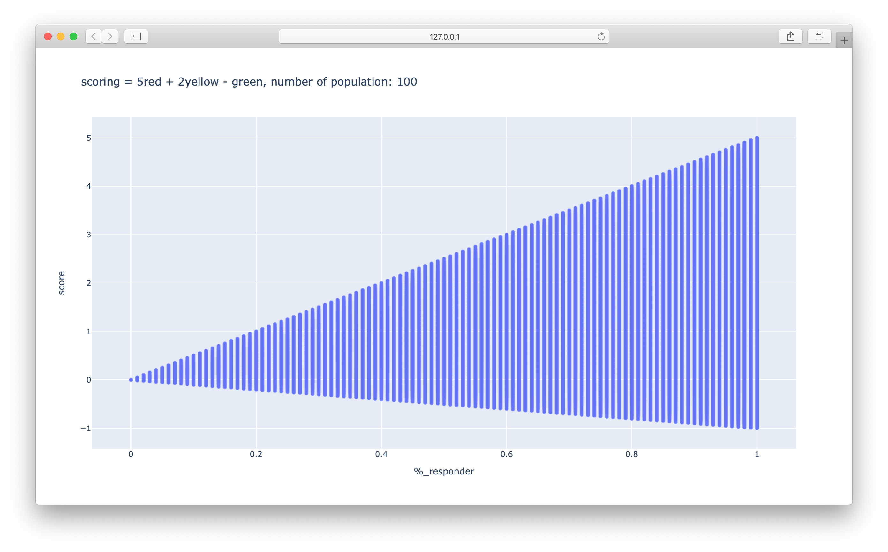

# Status score km grid

algorithm scoring to determine km grid status based on number of user report


### Prerequisites

- python3

### Installing

```
pip install -r requirements.txt
```

## create dummy data

run:
```
python create_csv_randomdata.py
```
or set number population
```
python create_csv_randomdata.py <population>
```
output: 
- dummy_data.csv


### plot data

plot with plotly

```
python plot_csv.py
```


### run scoring

get status km_grid

```
python status_score.py <count_green> <count_yellow> <count_red> <population>
```

## License

This project is licensed under the MIT License - see the [LICENSE.md](LICENSE.md) file for details

