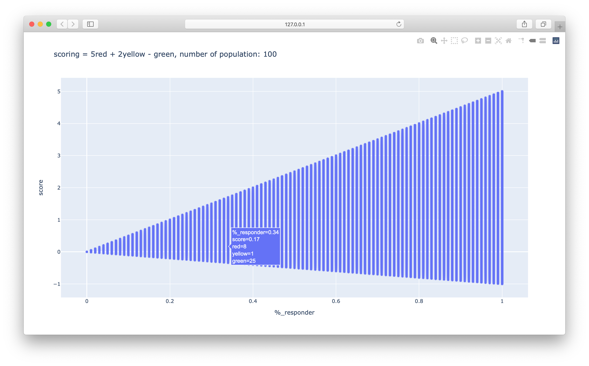

# Status score km grid

algorithm scoring to determine km grid status based on number of user report


### Prerequisites

- python3

### Installing

```
pip install -r requirements.txt
```

## run plot data

run:
```
python plot_data
```
output: 
- dummy_data.csv
- scoring_data.csv




## License

This project is licensed under the MIT License - see the [LICENSE.md](LICENSE.md) file for details

